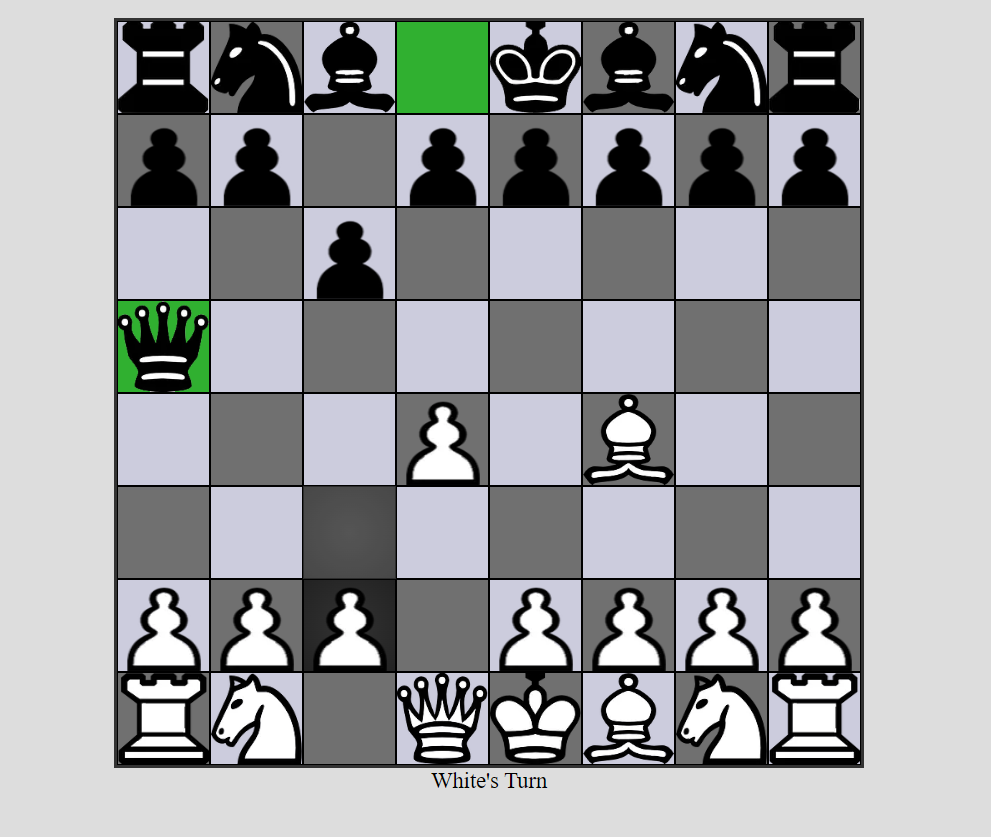

# Chess Game AI

A complete, well-automated chess game made with object-oriented JavaScript. Play against a human or a challenging AI.

## How to Run
1. Open `chess.html` in your web browser (no server required).
2. All assets are included locally; just double-click the file or open with your browser.

## Requirements
- No installation required. Works in any modern web browser (Chrome, Firefox, Edge, Safari, etc.).
- No external libraries or frameworks needed.

## How to Play
- Choose to play against another human or the AI.
- If playing against AI, select your color (white or black).
- Click the pieces to select and move them according to chess rules.
- The game supports all standard chess moves, including castling and pawn promotion.
- The game ends with checkmate.

## Screenshot

## Algorithm Used
- **Minimax Algorithm**: The AI uses a depth-limited minimax algorithm to evaluate possible moves and select the best one. It simulates future moves up to a certain depth, scoring board positions based on material and positional heuristics. The AI is designed to provide a challenging opponent.

---

The chess piece images are originally made by [Clker-Free-Vector-Images](https://pixabay.com/users/Clker-Free-Vector-Images-3736/?utm_source=link-attribution&utm_medium=referral&utm_campaign=image&utm_content=26774) from [Pixabay](https://pixabay.com/?utm_source=link-attribution&utm_medium=referral&utm_campaign=image&utm_content=26774). You can get them from [here](https://pixabay.com/vectors/chess-pieces-set-symbols-game-26774/).