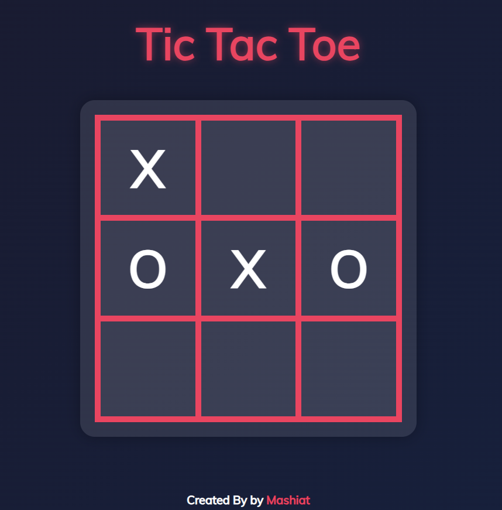

# Tic-Tac-Toe AI

Play a game of Tic-Tac-Toe against a computer AI with three difficulty levels.

## How to Run
1. Open `index.html` in your web browser (no server required).
2. All assets are included locally; just double-click the file or open with your browser.

## Requirements
- No installation required. Works in any modern web browser (Chrome, Firefox, Edge, Safari, etc.).
- No external libraries or frameworks needed.

## How to Play
- Choose to play as X or O.
- Select the difficulty: Easy, Medium, or Hard.
- Click on the board to make your move. The AI will respond automatically.
- The game ends when either player wins or the board is full (tie).
- Click "Play Again" to start a new game.

## Screenshot

## Algorithm Used
- **Easy Mode**: The AI blocks obvious wins and otherwise plays randomly.
- **Medium Mode**: The AI mixes random moves with optimal moves (using minimax about 30% of the time).
- **Hard Mode**: The AI always plays optimally using the **Minimax algorithm with alpha-beta pruning**, making it unbeatable if you play perfectly.

Enjoy challenging yourself against different AI levels!
